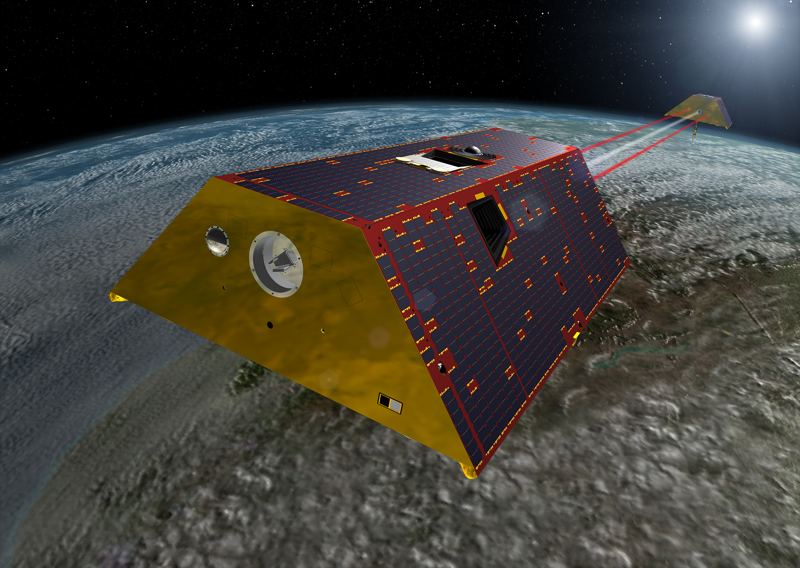
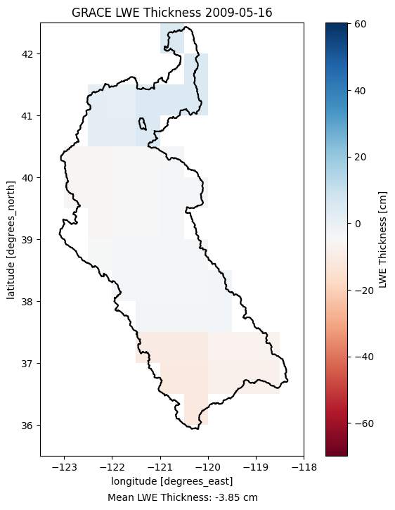
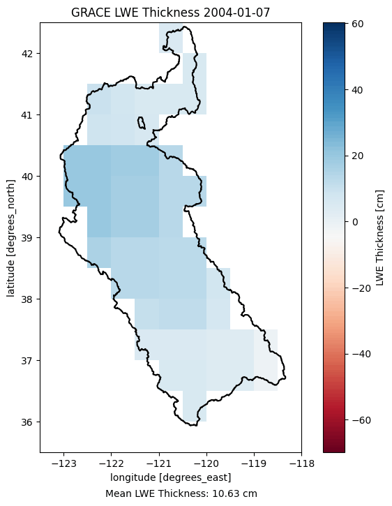
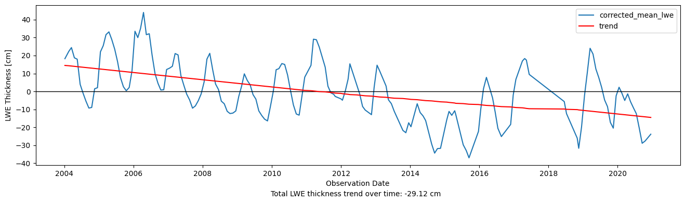

name: inverse
layout: true
class: center, middle, inverse
---
# GRACE LWE Groundwater Exploration
### Jarrett Keifer
---
layout: false
## Overview

1. Project Objectives

2. What is GRACE?

3. GRACE Datasets

4. Project Deliverables

5. How does the tool work?

6. Next Steps


---
template: inverse
# 1. Project Objectives
---
## 1. Project Objectives

- Gain an understanding of available GRACE data and how to use them

- Use GRACE data to visualize estimated groundwater

- Build tooling to produce such visualizations for Areas of Interest (AOIs)


---
template: inverse
# 2. What is GRACE?
---
## 2. What is GRACE?

- Gravity Recovery and Climate Experiment (GRACE)

- NASA and German Aerospace Center joint mission

- Measures Earth's gravity field anomalies

<center></center>
.footnote[Image: [NASA JPL GRACE-FO Mission Overview](https://gracefo.jpl.nasa.gov/mission/overview/)]
---
## 2. What is GRACE?

- Two satellites, distance between affected by gravity field anomalies

- Operated between 2002 and 2017

- GRACE-FO "follow-on" continues to get data (from 2018)

<center></center>
.footnote[Image: [NASA JPL GRACE-FO Mission Overview](https://gracefo.jpl.nasa.gov/mission/overview/)]


---
template: inverse
# 3. GRACE Datasets
---
## 3. GRACE Datasets

- Four levels of data available, 0 to 3, from least to most processed
---
## 3. GRACE Datasets

- Four levels of data available, 0 to 3, from least to most processed

    - Level 0

        - Raw telemetry data from GRACE satellites

        - Each satellite pass downloaded in to a file (two files per pass)

        - Not really for public consumption
---
## 3. GRACE Datasets

- Four levels of data available, 0 to 3, from least to most processed

    - Level 1A

        - Non-destructive conversion of level 0 binary data

        - Engineering units and timing corrections

        - Formatting and ancillary data to support additional processing

    - Level 1B

        - Irreversable processing

        - Sample rates reduced

        - Formatting and ancillary data to support additional processing

    - Level 1 processing provided by JPL
---
## 3. GRACE Datasets

- Four levels of data available, 0 to 3, from least to most processed

    - Level 2

        - Gravity field estimates

        - Processed using multiple, independent models by JPL, UTCSR, and GFZ

        - "Spherical harmonic coefficients of the 'geopotential'" [0]

            - Fancy way to refer to math that represents the total gravitational
              potential of the Earth system (I think?)

        - The lowest degree spherical harmonic (60 deg) corresponds to about 330km
          of spatial resolution

.footnote[[0] [GRACE Level 3 Handbook](https://podaac-tools.jpl.nasa.gov/drive/files/allData/gracefo/docs/GRACE-FO_L3_Handbook_JPL.pdf)]
---
## 3. GRACE Datasets

- Four levels of data available, 0 to 3, from least to most processed

    - Level 3

        - Level 2 data heavily processed to find "mascons" (mass concentrations)

        - Represent changes in mass throughout parts of the Earth gravity system

            - Filters tuned for domain-specific products

        - De-correlation filters and smoothing can remove N-S data anomalies

            - A static scaling factor dataset allows adding in some lost anomalies

        - Each mascon a "surface mass deviation for that month relative to a
          baseline temporal average" [0]

.footnote[[0] [GRACE Level 3 Handbook](https://podaac-tools.jpl.nasa.gov/drive/files/allData/gracefo/docs/GRACE-FO_L3_Handbook_JPL.pdf)]
---
## 3. GRACE Datasets

- Four levels of data available, 0 to 3, from least to most processed

<center></center>
.footnote[Image: [GRACE Level 3 Handbook](https://podaac-tools.jpl.nasa.gov/drive/files/allData/gracefo/docs/GRACE-FO_L3_Handbook_JPL.pdf)]
---
## 3. GRACE Datasets

- GRACE data selected for this project:

    - GRCTellus.JPL.200204_202103.GLO.RL06M.MSCNv02CRI.nc

    - CLM4.SCALE_FACTOR.JPL.MSCNv02CRI.nc


---
template: inverse
# 4. Project Deliverables
---
## 4. Project Deliverables

- We need to get the data

- We need to process the data

- We need to understand the data processing
---
## 4. Project Deliverables

- We need to get the data

    - Several scripts to automate data retrieval

    - Also perform clean up steps to get data ready for analysis
---
template: inverse
class: center, middle
# DATA DEMO
---
## 4. Project Deliverables

- We need to process the data

    - Python cli tool called `ggw` to:

        - `map`

        - `animate`

        - `plot`

---
## 4. Project Deliverables

Like this:
```
$ ggw map [ -d DATA_DIR ] AOI_FILE YYYY-MM OUTFILE
```

<center></center>
---
## 4. Project Deliverables

Like this:
```
$ ggw animate [ -d DATA_DIR ] [ --fps FPS ] AOI_FILE START_YYYY-MM END_YYYY-MM OUTFILE
```

<center></center>
---
## 4. Project Deliverables

Like this:
```
$ ggw plot [ -d DATA_DIR ] AOI_FILE START_YYYY-MM END_YYYY-MM OUTFILE
```

<br />
<br />
<br />
<center></center>
---
template: inverse
class: center, middle
# ggw DEMO
---
## 4. Project Deliverables

- We need to understand the data processing

    - Documentation

        - Project includes `analysis.ipynb` with walkthrough

        - README and scripts

        - These slides


---
template: inverse
# 5. How does the tool work?
---
## 5. How does the tool work?

- Open AOI and GRACE datasets

- Clip GRACE data/scale factor to AOI extent

- Mask GRACE data/scale factor to AOI boundary

- Multiply each GRACE observation by the scale factor
---
## 5. How does the tool work?

- For mapping operations:

    - Scale range is determined across all observations,
      regardless of date range

- For operations over a date range:

    - Find mean of each cell over date range and subtract the result
      from each observation to ensure anomolies are relative to the
      time-mean gravity field over the date range
---
## 5. How does the tool work?

- When plotting a simple linear regression is added

- We calculate the total trend change to understand
  if we have a net loss or gain over that time frame


---
template: inverse
# 6. Next Steps
---
## 6. Next Steps

- Project AOI and calculate area to turn LWE thickness into water volume

- Allow trend line to accommodate missing dates

- Factor in LWE uncertainties

- Use other data to further isolate groundwater signal vs other mass transfer
  (snow water equivalent, surface water, soil moisture)

- Better performance

- Incorporate user feedback
---
template: inverse
# Thank you!
## Questions?

<br />
<br />
<br />
.left[
### Selected References

- [NASA JPL GRACE-FO Mission Overview](https://gracefo.jpl.nasa.gov/mission/overview/)
- [GRACE Level 1B Handbook](https://podaac-tools.jpl.nasa.gov/drive/files/allData/grace/docs/Handbook_1B_v1.3.pdf)
- [GRACE Level 2 Handbook](https://podaac-tools.jpl.nasa.gov/drive/files/allData/grace/docs/L2-UserHandbook_v4.0.pdf)
- [GRACE-FO Level 3 Handbook](https://podaac-tools.jpl.nasa.gov/drive/files/allData/gracefo/docs/GRACE-FO_L3_Handbook_JPL.pdf)
- [Rodell et al., Satellite-based estimates of groundwater depletion in India](https://escholarship.org/uc/item/22577805)
]
